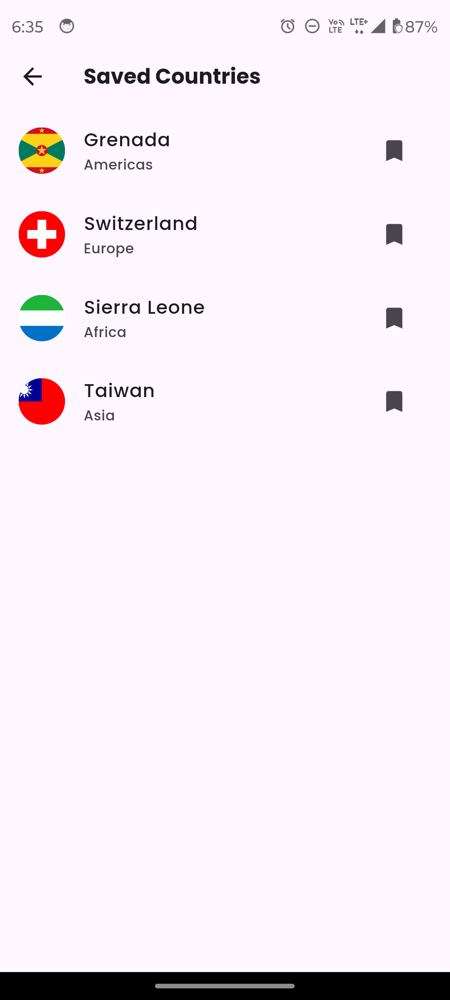
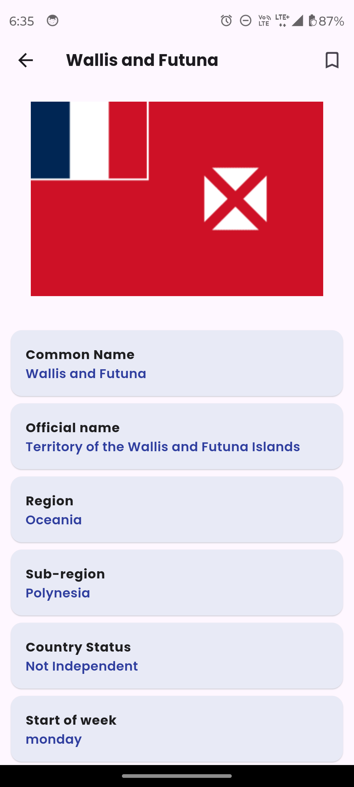

# Terrapedia

Terrapedia is an app designed to help users explore and view information about countries around the world. The app provides a simple and interactive interface where users can browse through countries, filter them by status, save their favorite countries locally, and view detailed information on each country.

## Features

- **Home Page**:
  - Displays a list of all countries using `ListView` (ListTile).
  - Provides filter options to view countries by:
    - **All**: Shows all countries.
    - **Independent**: Shows only independent countries.
    - **Dependent**: Shows only dependent territories.

- **Filter Options**:
  - Users can filter countries based on their political status (independent, dependent, or default to all).
- **Save to Favorites**:
  - Save specific countries locally using **SharedPreferences**.
  - View saved countries on a dedicated "Saved Countries" screen.
- **Details Screen**:
  - Tap on a country to view detailed information about that country including its name, capital, population, and other relevant data.
## Getting Started
### Prerequisites
- **Flutter SDK**: Make sure you have Flutter installed. [Flutter Installation Guide](https://flutter.dev/docs/get-started/install)
- **API**: Ensure you're connected to the countries API (if applicable) to fetch country details.
## Usage
- **Viewing Countries:**
  - Open the app to view the list of countries on the home screen.
- **Filter Countries:**
  - Use the filter option to toggle between viewing independent, dependent, or all countries.
- **Save a Country:**
  - On the home screen, tap the 'Save' button next to any country to add it to your saved countries list.
- **View Saved Countries:**
  - Navigate to the 'Saved' screen from the menu to view all countries you've saved.
- **Country Details:**
  - Tap on a country in the list to view detailed information on the country.
## Screenshots
<table style="border-collapse: collapse; width: 100%;">
<tr>
<th colspan="4" style="text-align: center; border: 0;">Screenshots</th>
</tr>
<tr>
<td style="width: 250px; border: 0;">


</td>
<td style="width: 220px; border: 0;">


</td>
<td style="width: 220px; border: 0;">


</td>
<td style="width: 220px; border: 0;">


</td>

</tr>
<tr>
<td style="width: 250px; border: 0;">



</td>
<td style="width: 220px; border: 0;">


</td>
<td style="width: 220px; border: 0;">



</td>

</tr>

</table>

## Technologies Used
- **Flutter:** The primary framework for building the app.
- **SharedPreferences:** For storing and retrieving saved countries locally.
- **Provider:** Used for managing app state.
- **REST API (optional):** Fetch country details from an external API.
  Contributing
  If you'd like to contribute to Terrapedia, feel free to open a pull request or file an issue with any suggestions or bug reports.
## Installation

   ```bash
   git clone https://github.com/jagritixjha/terrapedia.git